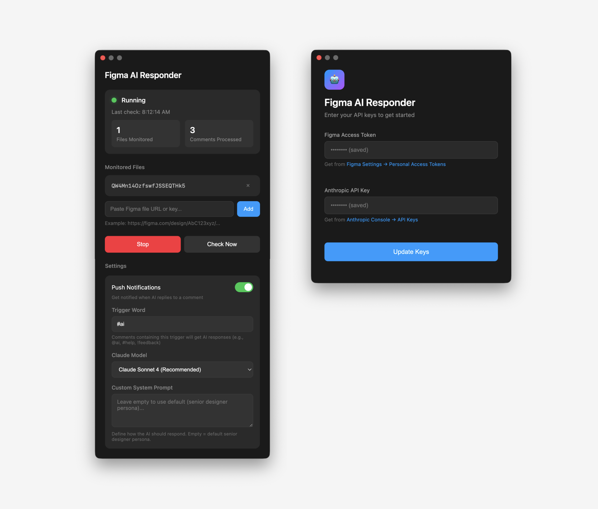

# Figma AI Responder

A Mac menu bar app that responds to comments in Figma with Claude-powered design feedback.



---

## Features

- **Customizable trigger word** — Use `@ai`, `#help`, `!feedback`, or any trigger you want
- **Thread-aware responses** — AI reads the full conversation before replying
- **Screenshot context** — Captures the frame where the comment is pinned
- **Multiple Claude models** — Choose from Sonnet 4, Opus 4.6, Opus 4.5, or Haiku
- **Custom AI persona** — Define your own system prompt or use the default expert designer
- **Push notifications** — Get notified when AI replies (optional)
- **Secure storage** — API keys stored in macOS Keychain
- **Multiple files** — Monitor as many Figma files as you want

---

## Installation

### Option A: Download DMG (easiest)

1. Download the latest `.dmg` from [Releases](https://github.com/madebysan/figma-ai-responder/releases)
2. Open the DMG and drag **Figma AI Responder** to your Applications folder

#### macOS security warning

Because this app is not signed with an Apple Developer certificate, macOS will show a warning saying the app **"is damaged and can't be opened"** when you first try to launch it. The app is not actually damaged — this is macOS blocking software it can't verify.

**To fix this, open Terminal and run:**

```bash
xattr -cr ~/Downloads/Figma\ AI\ Responder-2.0.0-arm64.dmg
```

> Replace the file path above if you saved the DMG somewhere other than Downloads, or if the version number is different.

Then open the DMG again and drag the app to Applications.

If you already moved the app to Applications and it still won't open, run:

```bash
xattr -cr /Applications/Figma\ AI\ Responder.app
```

**What does this command do?** It removes the "quarantine" flag that macOS adds to files downloaded from the internet. This is safe to run — it just tells macOS you trust the file.

**Alternative method (no Terminal):**
1. Try to open the app (it will show the warning)
2. Open **System Settings → Privacy & Security**
3. Scroll down — you should see a message about the blocked app
4. Click **"Open Anyway"**

### Option B: Build from source

If you'd prefer to build the app yourself (no security warnings this way):

```bash
git clone https://github.com/madebysan/figma-ai-responder.git
cd figma-ai-responder
npm install
npm run dist
```

The DMG will appear in the `release/` folder. Since you built it locally, macOS won't block it.

---

## Quick Start

### 1. Enter your API keys

The app will prompt you for:
- **Figma Access Token** — [Get from Figma Settings](https://www.figma.com/developers/api#access-tokens)
- **Anthropic API Key** — [Get from Anthropic Console](https://console.anthropic.com/settings/keys)

Your keys are stored securely in macOS Keychain.

### 2. Add files to monitor

1. Click the menu bar icon → **Open**
2. Paste a Figma file URL
3. Click **Add**
4. Click **Start**

---

## How It Works

```
You comment "#help is this button too small?"
    ↓
App polls Figma every 30 seconds
    ↓
Finds comments with your trigger word
    ↓
Captures screenshot of the pinned frame
    ↓
Claude analyzes design + reads thread history
    ↓
AI reply appears in Figma
```

---

## Development

```bash
npm run dev       # Run in dev mode
npm run dist      # Build DMG
```

---

## Troubleshooting

**"App is damaged and can't be opened"**
- This is a macOS Gatekeeper warning, not actual damage — see [Installation](#macos-security-warning) above
- Run `xattr -cr` on the DMG or app file, or use System Settings → Privacy & Security → Open Anyway

**No response to comments**
- Is monitoring started? (green indicator in menu bar)
- Does the comment contain your trigger word?
- Is the comment pinned to an element (not floating on canvas)?

**"Secure storage not available"**
- The app requires macOS Keychain access
- Try restarting the app or your Mac

**AI sees wrong frame**
- Pin comments directly to elements, not the canvas
- The AI screenshots the parent frame of the pinned element

**Notifications not working**
- Check System Settings → Notifications
- In dev mode, look for "Electron"; in production, "Figma AI Responder"

---

## License

MIT
