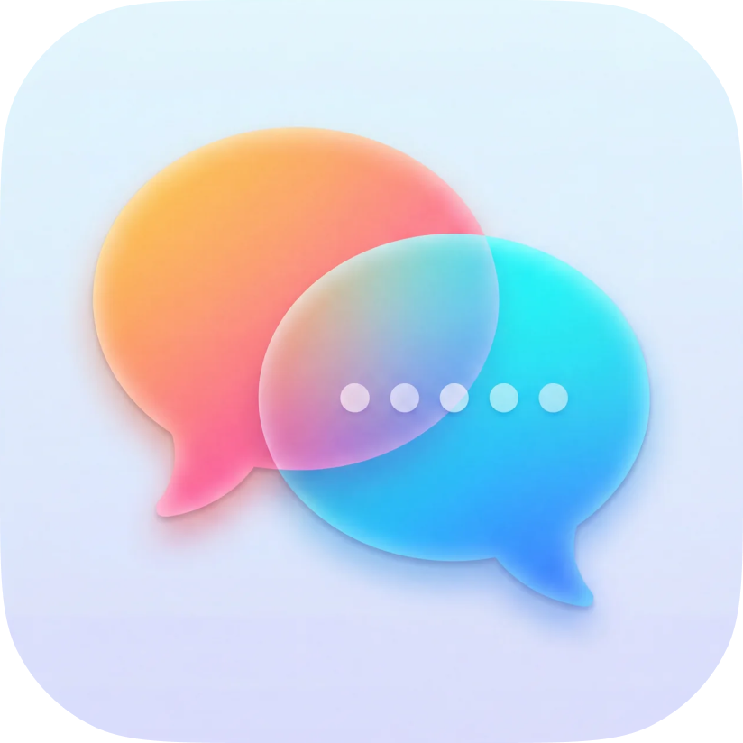

<p align="center">
  
</p>

<h1 align="center">Figma AI Responder</h1>

<p align="center">A macOS menu bar app that automatically responds to @AI mentions<br>
in Figma comments using Claude's vision API.</p>

<p align="center">macOS · Electron · Node.js</p>

## What It Does

This app monitors Figma files for comments containing a trigger phrase (default: `@AI`) and automatically generates design feedback using Claude. It runs quietly in the menu bar and responds to questions about UI, UX, accessibility, copy, and implementation feasibility.

Key features:

- Polls Figma files for new comments at configurable intervals
- Takes screenshots of the design frame where the comment is placed
- Sends the screenshot + comment context to Claude for analysis
- Posts AI-generated responses back to Figma as threaded replies
- Maintains conversation history within comment threads
- Customizable system prompt, Claude model, and trigger phrase
- macOS native menu bar interface with status indicators

## How It Works

1. You configure the app with your Figma access token and Anthropic API key
2. Add Figma file keys to monitor
3. The app polls those files every N seconds (configurable, default 60s)
4. When someone posts a comment containing the trigger phrase, the app:
   - Captures a screenshot of the design node where the comment is pinned
   - Builds the conversation thread history (if replying to an existing thread)
   - Sends the image + context to Claude with a design expert system prompt
   - Posts Claude's response back to Figma as a reply

The AI is configured to act as an expert product designer providing tactical feedback on usability, visual hierarchy, accessibility, copy, and engineering tradeoffs.

## Setup

### Prerequisites

- macOS (menu bar app)
- Node.js and npm
- Figma Personal Access Token
- Anthropic API Key

### Installation

Clone the repo and install dependencies:

```bash
git clone <repo-url>
cd mac-figma-ai-responder-app
npm install
```

Build the app:

```bash
npm run build
```

Run in development mode:

```bash
npm start
```

Or build a distributable macOS app:

```bash
npm run dist
```

The built app will be in the `release/` directory.

### First-Time Configuration

On first launch, the app will open a setup window asking for:

- **Figma Access Token** - Get from Figma Settings → Personal Access Tokens
- **Anthropic API Key** - Get from Anthropic Console → API Keys

Both are validated before saving.

After setup, you'll see the dashboard where you can:

- Add Figma file URLs to monitor (paste any `figma.com/file/...` URL)
- Customize the Claude model (default: `claude-sonnet-4-20250514`)
- Edit the system prompt (defines AI personality and response style)
- Change the trigger phrase (default: `@AI`)
- Set polling interval (default: 60 seconds)
- Enable/disable desktop notifications

## Usage

### Menu Bar Controls

The app lives in your menu bar. The icon shows whether monitoring is active:

- **Filled icon** - Running and monitoring files
- **Outline icon** - Stopped

Right-click the menu bar icon to:

- Start/Stop monitoring
- Check Now (manual poll)
- Open the dashboard
- Update API keys
- Quit

### Adding Files to Monitor

1. Click "Open" in the menu bar to open the dashboard
2. Paste a Figma file URL in the input field (e.g., `https://figma.com/file/abc123/My-Design`)
3. The app extracts the file key and starts monitoring it

### Using in Figma

Once the app is running and monitoring files:

1. Post a comment in Figma containing your trigger phrase (e.g., "What do you think about this layout? @AI")
2. The app will detect the comment on its next polling cycle
3. It captures a screenshot of the design and sends it to Claude
4. Claude's response is posted as a reply to your comment

The AI can see the screenshot and any previous messages in the thread, so you can have multi-turn conversations.

### Customization

**Change the trigger phrase:** Open the dashboard and update the "Trigger Phrase" field. The app will only respond to comments containing this exact text (case-insensitive).

**Switch Claude model:** Choose from the available models in the dashboard. Current options include Sonnet and Opus variants.

**Edit the system prompt:** Click "Edit System Prompt" to customize how the AI responds. The default prompt configures it as an expert product designer providing tactical feedback.

**Adjust polling interval:** Set how often the app checks for new comments (in seconds). Lower = more responsive, but more API calls.

## Development

```bash
npm run build     # Build TypeScript and copy renderer files
npm start         # Build and run the app
npm run dev       # Build and run in dev mode
npm run dist      # Build distributable DMG
npm run icons     # Generate tray icons
```

## Tech Stack

- **Framework:** Electron (Node.js + Chromium)
- **Language:** TypeScript
- **APIs:**
  - Figma REST API (comments, files, images)
  - Anthropic Claude API (vision + text generation)
- **Build:** electron-builder (macOS DMG packaging)
- **Storage:** electron-store (persistent settings)

## File Structure

```
src/
├── main/
│   ├── main.ts           # Electron main process, menu bar setup
│   ├── polling.ts        # Polling loop that checks Figma for new comments
│   ├── store.ts          # Persistent storage for settings and state
│   └── preload.js        # Bridge between main and renderer processes
├── services/
│   ├── figma-api.ts      # Figma REST API client
│   ├── figma-image.ts    # Screenshot capture logic
│   └── claude-api.ts     # Claude API client with vision support
├── prompts/
│   └── system-prompt.ts  # Default AI persona and instructions
├── renderer/
│   ├── setup.html        # First-time API key configuration UI
│   └── index.html        # Main dashboard UI
└── types.ts              # TypeScript type definitions
```

---

## License

MIT
