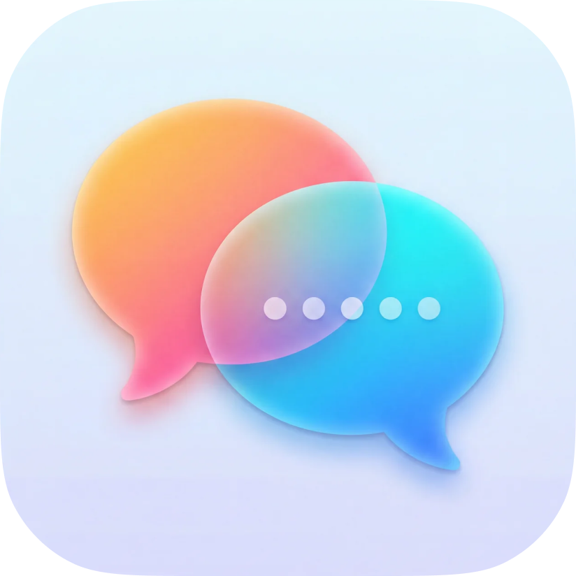

<p align="center">
  
</p>

<h1 align="center">Figma Responder</h1>

<p align="center">@ai in a Figma comment. Claude replies with design feedback.<br>
Inline design review without leaving the file.</p>

<p align="center">macOS · Electron · Node.js</p>
<p align="center"><a href="https://github.com/madebysan/figma-responder/releases/latest"><strong>Download Figma Responder</strong></a></p>

<p align="center">
  <video src="assets/demo.mp4" controls width="720"></video>
</p>

---

I use AI every day in my design workflow for copy rewrites, UX audits, accessibility checks, feedback loops. It's great. But the friction of switching apps, taking screenshots, and losing context breaks the flow.

So one weekend I built the feature I wish Figma already had. A small Mac menu bar app: you leave a comment in your Figma file with a trigger phrase (default `@ai`), and you get an AI response directly in the thread, with full visual context of the frame you're commenting on. No screenshots. No app switching.

A few things worth knowing:

- You choose which Figma files to monitor.
- You bring your own API keys (Anthropic + Figma), stored Keychain-encrypted on your Mac.
- Custom trigger phrase (use `@ai`, `#help`, `@designer`, whatever fits your team).
- Editable system prompt, so you can shape the kind of feedback you get.
- Multi-turn conversations work. The app sends thread history with each request, so follow-ups stay in context.

**What it doesn't do.** Automated fixes. For "move this 4px and swap the token," use [figma-autopilot](https://github.com/madebysan/claude-figma-skills) in Claude Code. This one comments back, doesn't modify the file.

Next up: multiple triggers mapped to different prompts, so `#copy` gets a copywriter reply, `#a11y` gets an accessibility pass, etc.

## How it works

1. Configure your Figma access token and Anthropic API key on first launch
2. Paste a Figma file URL into the dashboard to start monitoring it
3. The app polls that file every N seconds (default 30s)
4. When a comment matches the trigger phrase, the app:
   - Captures a screenshot of the frame where the comment is pinned
   - Builds the thread history (if replying to an existing thread)
   - Sends image + context to Claude with the design-reviewer system prompt
   - Posts the response as a reply

## Setup

### Prerequisites

- macOS
- Node.js and npm
- A Figma personal access token (Settings → Personal Access Tokens)
- An Anthropic API key (console.anthropic.com → API Keys)

### Install

```bash
git clone https://github.com/madebysan/figma-responder.git
cd figma-responder
npm install
npm run build
```

Run in dev mode:

```bash
npm start
```

Or build a distributable DMG:

```bash
npm run dist
```

The packaged app lands in `release/`.

### First-time configuration

On first launch, a setup window asks for your Figma access token and Anthropic API key. Both are validated before saving.

Once configured, the dashboard lets you:

- Add Figma file URLs to monitor (paste any `figma.com/file/...` URL; the app extracts the file key)
- Customize the Claude model (default `claude-sonnet-4-6`)
- Edit the system prompt (defines AI persona and response style)
- Change the trigger phrase (default `@ai`, case-insensitive)
- Set the polling interval (default 30s; going lower can hit Figma rate limits on active files)
- Toggle desktop notifications

## Usage

The app lives in the menu bar. Filled icon = monitoring, outline icon = stopped. Right-click the icon for Start/Stop, Check Now (manual poll), Open dashboard, Update API keys, Quit.

Once the app is running and pointed at a file, post a comment in Figma containing your trigger phrase. For example: *"What do you think about this hierarchy? @ai"*. On the next polling cycle, the app grabs a screenshot of the pinned frame, sends it to Claude, and posts the reply into the same thread.

Multi-turn conversations work because the app builds the full thread history into each request. So you can ask follow-ups in the same Figma comment thread and Claude has the earlier context.

## Privacy

Your Figma access token and Anthropic API key are encrypted with macOS Keychain via Electron's `safeStorage`. If Keychain isn't available, the app refuses to save credentials — no fallback to plaintext.

The app talks directly to Figma and Anthropic, with no server in between. When a comment trips your trigger, the outgoing request carries the comment text and a screenshot of the pinned frame. Nothing else leaves your device. No analytics, no telemetry, no usage tracking.

## Development

```bash
npm run build     # Build TypeScript + copy renderer files
npm start         # Build and run
npm run dev       # Build and run in dev mode
npm run dist      # Build distributable DMG
npm run icons     # Generate tray icons
```

## Tech stack

- **Framework:** Electron (Node.js + Chromium)
- **Language:** TypeScript
- **APIs:** Figma REST (comments, files, images) + Anthropic (vision + text)
- **Build:** electron-builder for macOS DMG
- **Storage:** electron-store for persistent settings

## File structure

```
src/
├── main/
│   ├── main.ts           # Electron main process, menu bar setup
│   ├── polling.ts        # Polling loop for new comments
│   ├── store.ts          # Persistent storage for settings and state
│   └── preload.js        # Bridge between main and renderer
├── services/
│   ├── figma-api.ts      # Figma REST API client
│   ├── figma-image.ts    # Screenshot capture
│   └── claude-api.ts     # Claude client with vision support
├── prompts/
│   └── system-prompt.ts  # Default AI persona and instructions
├── renderer/
│   ├── setup.html        # First-time API key UI
│   └── index.html        # Main dashboard UI
└── types.ts              # TypeScript type definitions
```

## Known Issues

- **Figma API rate limits.** Polling intervals below ~30s on active files can hit Figma's REST API rate limits, which temporarily pauses monitoring. The default 30s interval is usually fine.
- **Deep-frame screenshots.** When a comment is pinned inside a deeply-nested frame or component, the captured image returns the bounding frame rather than the specific element. Claude sees more context than intended, or misses the element being discussed.
- **Comment pin drift.** Figma reports the pin coordinate at the time the comment was placed. If the underlying element is moved or resized afterwards, the captured screenshot can be off-center or no longer contain the element.
- **Polling, not webhooks.** Figma's comment API is poll-only for personal tokens, so there is a lag between posting a comment and receiving a reply (bounded by your polling interval).

## Feedback

Found a bug or have a feature idea? [Open an issue](https://github.com/madebysan/figma-responder/issues).

## License

[MIT](LICENSE)

---

Made by [santiagoalonso.com](https://santiagoalonso.com)
